# Architecture

## The one-paragraph version

This is a **data cache**, not a page cache. It stores validated `ArticleData` objects — never
rendered HTML — and it lives in the service layer, between the article page and the CMS. The
key is the article `path` and nothing else.

It has two independent dials:

- a **fresh window of 1 second**, which sheds load. Inside it, we serve from memory and never
  touch the CMS.
- a **stale window that never expires**, because a slightly old article beats a 500.

And one invariant that everything else follows from:

> **A cache entry is overwritten only by a successful, validated response.**
> A timeout doesn't evict it. A 500 doesn't evict it. Corrupt JSON doesn't evict it.

That single rule is why `down`, `hang`, and `corrupt` are all survivable. Once we have a good
copy of an article, the only thing that can replace it is a better copy.

---

## The cast

Ten small pieces. Every diagram below refers to them by these short names.

| Short name | File | What it does |
|---|---|---|
| **Proxy** | [proxy.ts](../proxy.ts) | Adds CDN headers on the way out; turns an unavailable article into a 503 |
| **Service** | [services/articleService.ts](../services/articleService.ts) | Maps a cache result into `ok` / `not_found` / `unavailable` |
| **Negative cache** | [lib/cache/notFoundCache.ts](../lib/cache/notFoundCache.ts) | Remembers 404s for 30s so crawlers can't hammer the CMS |
| **Policy engine** | [lib/cache/articleCache.ts](../lib/cache/articleCache.ts) | The brain: fresh/stale/cold decision, the 400ms deadline, single-flight |
| **Store** | [lib/cache/store.ts](../lib/cache/store.ts) | The Map. LRU capped at 500 entries, held on `globalThis` so dev HMR can't wipe it |
| **Client** | [lib/cms/cmsClient.ts](../lib/cms/cmsClient.ts) | The only `fetch` in the system. Hard 2s abort, classifies every result |
| **Validator** | [lib/cms/validateArticle.ts](../lib/cms/validateArticle.ts) | Rejects structurally-plausible garbage |
| **Breaker** | [lib/cache/circuitBreaker.ts](../lib/cache/circuitBreaker.ts) | 3 failures → open for 5s. Makes a known-dead CMS cost 1ms instead of 400ms |
| **Prewarm + Refresher** | [instrumentation.ts](../instrumentation.ts) | Fills the cache at boot; re-probes every warm article every 2s |
| **Push** | [app/api/internal/revalidate/route.ts](../app/api/internal/revalidate/route.ts) | Webhook endpoint: mark stale, refresh now, then purge the edge |

Cutting across all of them: **observability** ([lib/observability/](../lib/observability/)) —
structured logs and metrics emitted through a facade, plus `data-cache-status` /
`data-cache-age` attributes on the rendered article and a
[`/api/_internal/cache-stats`](../app/api/%5Finternal/cache-stats/route.ts) endpoint.

The Client classifies every upstream call into exactly one of five outcomes. These five words
are the vocabulary for the rest of this document:

`ok` · `not_found` · `timeout` · `http_error` · `invalid`

Only `ok` writes to the Store. `not_found` is deliberately separate from `http_error`: a
genuine 404 is a *real answer* about a non-existent article, and it proves the CMS is alive.

---

## The master flowchart

Everything below is a traversal of this one diagram. It's worth reading once slowly.

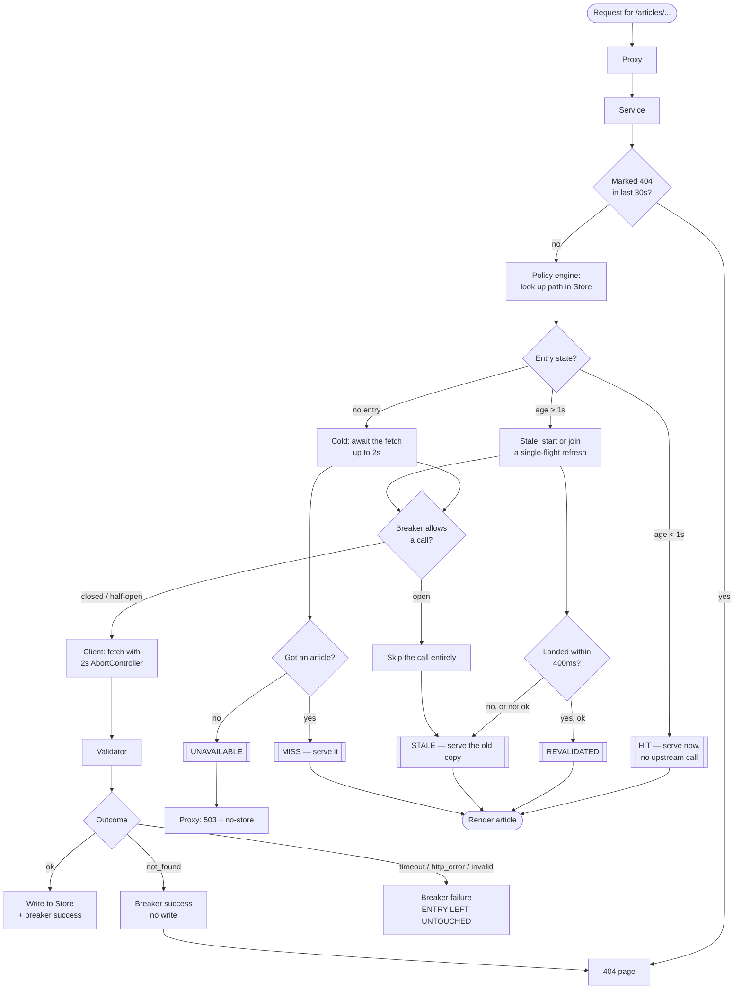

The five terminal statuses — `HIT`, `REVALIDATED`, `STALE`, `MISS`, `UNAVAILABLE` — are
visible in the page's `data-cache-status` attribute, which is how the e2e tests assert on
cache behaviour without needing response headers.

---

## Scenario walkthroughs

### Happy paths

#### 1. Warm and fresh — the common case

Someone requests an article we fetched less than a second ago.

**Systems:** Proxy → Service → Policy engine → Store. *That's it.*

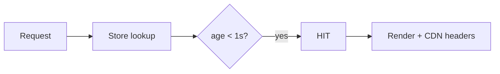

No upstream call, no breaker check, no timers. Under load, a thousand requests per second for
one article produce **one** CMS call per second. That's the entire job of the fresh dial.

#### 2. Cold start

The server just booted and the Store is empty.

**Systems:** Prewarm → Policy engine → Client → Validator → Store.

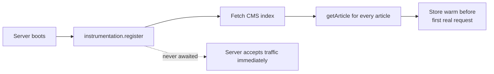

Prewarm is fire-and-forget and swallows all its errors — a dead CMS at boot must not stop the
server from starting. If a request beats prewarm to an article, it just takes the cold path:
await the fetch for up to 2s, serve `MISS`. Rare, and correct either way.

*Test: [tests/e2e/prewarm.spec.ts](../tests/e2e/prewarm.spec.ts)*

#### 3. Stale, upstream healthy

Entry is older than 1s, the CMS is fine.

**Systems:** Policy engine → Breaker → Client → Validator → Store.

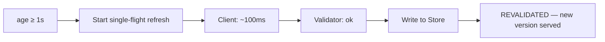

The refresh beat the 400ms deadline, so this reader gets the *new* content, not the old.

---

### Slow upstream — three different endings

You asked which ways "slow" can go. It's these three, and which one you get depends entirely
on the state of the cache entry and the breaker.

#### 4. Slow, but the entry is fresh

**Systems:** Policy engine → Store. Nothing else.

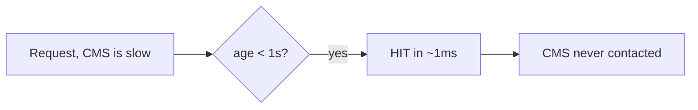

The slowness is *invisible*. We never talk to a slow CMS if we don't have to.

#### 5. Slow, entry is stale, breaker closed — the bounded wait

This is the interesting one.

**Systems:** Policy engine → Breaker → Client → (deadline expires) → Store.

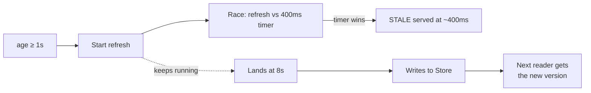

The reader waits **400ms, not 8 seconds**. The refresh isn't cancelled — it keeps going in the
background and its result lands for whoever asks next. We pay the latency once, in the
background, instead of on every request.

#### 6. Slow (or dead), and the breaker is already open

**Systems:** Policy engine → Breaker → Store.

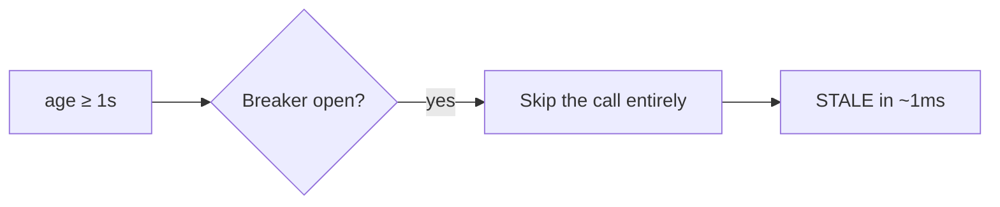

Once three calls in a row have failed, we stop paying 400ms per request to re-learn something
we already know. This is what turns `down` and `hang` from "slow but working" into "instant".

*Test: [tests/e2e/failure-modes.spec.ts](../tests/e2e/failure-modes.spec.ts) — `slow`*

---

### Broken upstream

#### 7. `down` — the CMS returns 500

**Systems:** Policy engine → Client (`http_error`) → Breaker → Store *(untouched)*.

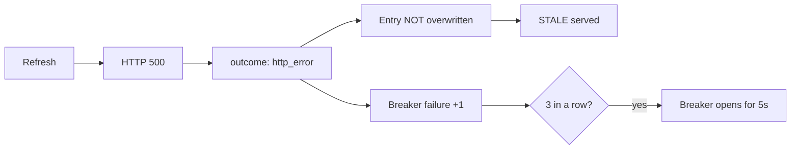

Reader gets correct content. Third consecutive failure opens the breaker, and every subsequent
request short-circuits to scenario 6.

#### 8. `hang` — the CMS never responds

**Systems:** same as `down`, plus the Client's `AbortController`.

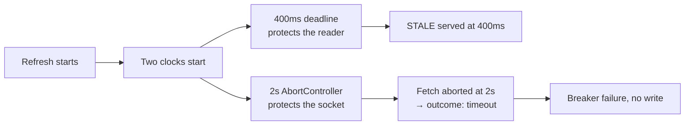

**This is the most commonly misread part of the system: there are two timeouts and they have
different jobs.** The 400ms deadline is about *user latency* — it decides when we stop waiting
and serve what we have. The 2s abort is about *resource safety* — without it, every hung
request leaks an open socket forever. The reader is never affected by the 2s value.

The single-flight entry is cleared in a `finally` block, so an aborted fetch can't leave a
dead promise behind for the next reader to join.

#### 9. `corrupt` — HTTP 200 with plausible-looking garbage

**Systems:** Client → **Validator** → Store *(untouched)*.

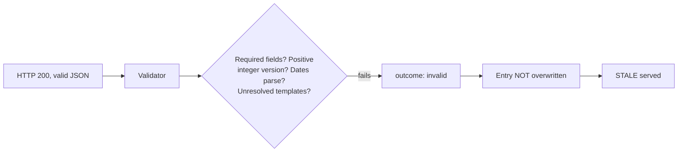

The corrupt payload is *structurally plausible* — it has the right field names and types.
Schema-shape checking alone would accept it. What catches it is the rule that no string may
contain an unresolved `{{...}}` template placeholder. Content correctness, not just JSON
correctness, is what qualifies a response to overwrite good data.

#### 10. Cold miss against a broken upstream

Nothing in the cache, and the CMS won't answer. The only case where we have nothing to serve.

**Systems:** Policy engine → `UNAVAILABLE` → Service → **Proxy**.

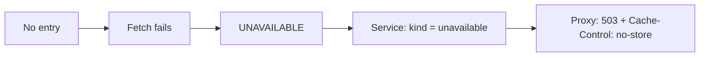

Two deliberate choices here. It's a **503, not a 200** — a 200 would be cached at the edge and
the outage served to every reader for the full TTL. And `no-store` guarantees nothing, at any
layer, retains the error page. A page component can't set a status code, which is why this
lives in the Proxy.

*Test: [tests/e2e/cdn-headers.spec.ts](../tests/e2e/cdn-headers.spec.ts)*

#### 11. A genuine 404

**Systems:** Client (`not_found`) → Service → Negative cache.

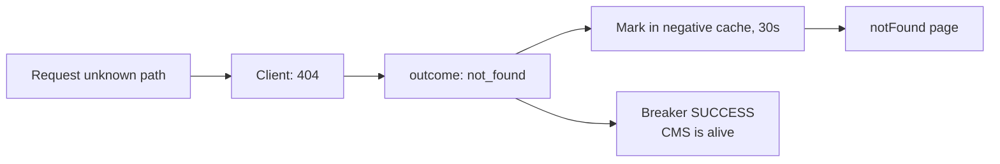

Note the last edge: a 404 counts as a breaker *success*. The CMS answered — it just answered
"no". Treating that as a failure would trip the breaker on crawler traffic. The 30s negative
cache stops a bad link from generating one upstream call per crawler hit.

---

### Corrections — three redundant triggers

A correction is published upstream. We have three independent ways to notice, and the
redundancy is the point: **push is a latency optimisation, not a correctness dependency.**

#### 12. Webhook enabled — the fast path

**Systems:** Admin route → Push → Policy engine → Client → Store → `purgeEdge`.

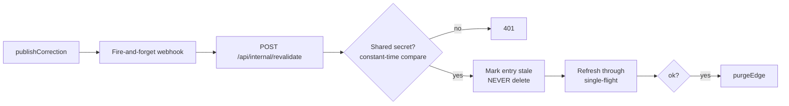

Two details worth defending:

- **It marks stale, it never deletes.** If a correction is published while the CMS is down,
  deleting would destroy the only good copy we have and turn a merely-stale page into an
  unavailable one. Mark-and-try preserves the fallback.
- **The edge is purged only *after* the origin refresh succeeds.** Purge first, and the CDN
  immediately re-fetches from an origin that still has the old version — and re-caches it. You'd
  need a second purge to land the correction.

The webhook call from the admin route is fire-and-forget and error-swallowed, so a slow or
broken webhook can never affect the publish response.

#### 13. Webhook dropped, zero traffic

**Systems:** Refresher → Policy engine → Client → Store.

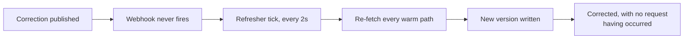

This is the important test. A dropped webhook should be a regression in *speed*, not in
*accuracy*. The refresher never sends `?source=`, so it's also what probes a real recovering
CMS and closes the breaker on its own.

#### 14. Webhook dropped, refresher hasn't ticked yet

**Systems:** Policy engine's read path (scenario 3, verbatim).

The entry is over 1s old, so the next reader starts a refresh and waits up to 400ms. The
correction lands on that read. Same mechanism as a normal stale read — nothing special.

*Tests: [tests/e2e/corrections.spec.ts](../tests/e2e/corrections.spec.ts),
[tests/e2e/push-invalidation.spec.ts](../tests/e2e/push-invalidation.spec.ts)*

---

### 15. Concurrency: one page render, one upstream call

A single page view actually reads the cache three times: once in the Proxy (to decide between
200 and 503), once in `generateMetadata`, and once in the page component. Next's fetch
memoization used to hide the duplication; now single-flight has to.

**Systems:** Policy engine's `inFlight` map.

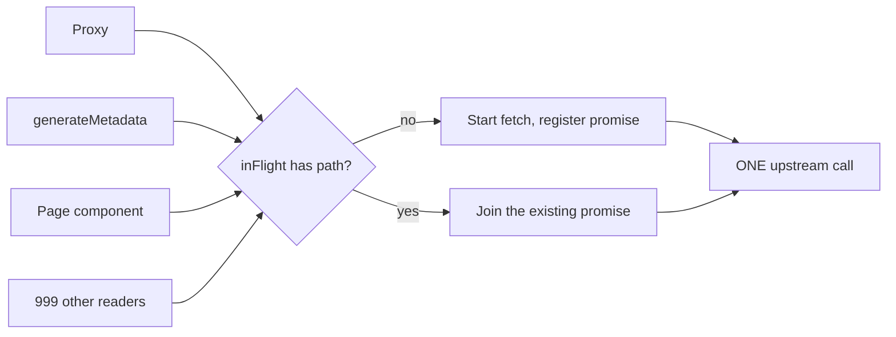

There's a load-bearing constraint here, flagged in a comment in the source: **no `await` may
run before the call into `getOrStartRefresh`**. Single-flight depends on every concurrent
caller finishing its synchronous prefix — store lookup, branch choice, `inFlight.set` — before
any of them suspends. One innocuous added `await` for logging would silently break it.

One honest caveat: single-flight collapses *concurrent* reads, and the Proxy read finishes
**before** the page read begins. So on a stale page view the Proxy can start and complete one
refresh, and the page read — finding `inFlight` already cleared — starts a second. Measured on
a stale `?source=down` request, that's ~230ms for a 100ms upstream, i.e. two sequential calls.
`generateMetadata` and the component *are* concurrent with each other and do collapse. This is
bounded and cheap, but it's two calls, not one.

---

## How a CDN fits in

There is no CDN wired up in this exercise. But the architecture is shaped so that adding one
is configuration, not redesign — and it's worth understanding what's already in place, because
those hooks are doing real work in the code today.

**The mental model: the CDN and this cache implement the same policy at two different layers.**
Fresh window, stale window, don't-evict-on-error — these are our internal concepts, and they
have exact equivalents as standard HTTP directives. So we express ours in that vocabulary on
the way out, and any CDN understands it without us writing CDN-specific logic.

Every article response carries these, set in the [Proxy](../proxy.ts):

```
Cache-Control: public, s-maxage=60, stale-while-revalidate=300, stale-if-error=86400
Surrogate-Key: article-<path>
```

Read them one at a time:

- **`s-maxage=60`** — the edge may serve this for 60s without asking us. Deliberately *much*
  longer than our internal 1s fresh window. That's not an inconsistency: invalidation at the
  edge is **push-based**, so the TTL is only a backstop for when a purge is missed. The 1s
  window exists to shed load; the 60s window exists because we can actively cancel it.
- **`stale-while-revalidate=300`** — for five minutes past expiry, the edge serves the old copy
  instantly and revalidates in the background. This is the CDN-layer version of our 400ms
  bounded wait: nobody waits on a refresh.
- **`stale-if-error=86400`** — if the origin is failing, the edge serves stale for up to a day.
  This is our unbounded-stale invariant, projected one layer out. It means the site survives
  even the origin going down entirely, not just the CMS.
- **`Surrogate-Key`** — enables **purge-by-tag** instead of purge-by-URL. It matters because one
  article can be reachable at several URLs (query params, alternate paths). Purging by URL
  means enumerating them all and getting it right; purging by tag is one call that catches
  every variant.

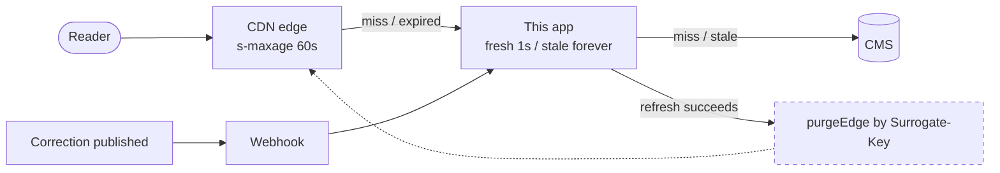

The dashed box is the only piece that isn't real yet.
[`purgeEdge()`](../lib/cache/purgeEdge.ts) exists as a **seam**: it computes the surrogate key
and emits a metric and a log line, but sends no HTTP call. Swapping in Fastly's or
Cloudflare's purge-by-tag API is a one-function change. Keeping it as a real function rather
than a TODO comment is what makes the *ordering* — purge only after the origin refresh
succeeds (scenario 12) — an actual property of the code, testable today, rather than a note
someone has to remember when the CDN arrives.

Two things a real deployment has to get right, both flagged in the code:

1. **`public` is only correct for anonymous traffic.** This repo has no auth, so nothing here is
   conditional. The day a session cookie exists, authenticated requests need their own branch —
   `private, no-store`, with personalization injected client-side or at the edge. An
   unconditional `public` becomes a personalization leak the moment login ships.
2. **Errors must never be cacheable.** Hence the 503 + `no-store` in scenario 10. Serving an
   outage as a cacheable 200 would multiply a brief origin blip into 60 seconds of site-wide
   breakage.

---

## Known interactions

**`?source=down` trips the *global* breaker.** The breaker is scoped to the upstream CMS as a
whole, not per-article — one CMS, one health signal. So hitting a failure mode in the demo
toolbar can make the *next* healthy request serve `STALE` for up to the 5s cooldown. The
content is still correct. The refresher never sends `source`, so it probes the real upstream
on its own and closes the circuit without any user request needing to.

**A 404 during an open circuit renders as a 503.** If the breaker is open when someone requests
a genuinely non-existent article, we skip the upstream call — so we can't distinguish "this
article doesn't exist" from "we can't reach the CMS to ask." We answer 503 (`no-store`), not
404. That's the right answer: it's honest about the uncertainty, and it isn't cached, so the
next request after the circuit closes gets a real 404. Observed live — the `cache_read` log
line shows `circuitState: "open"` alongside `status: "UNAVAILABLE"` for that request.

**The breaker rarely stays open in the demo.** `?source=down` failures do trip it (3 in a row),
but the refresher succeeds every 2s and resets the counter, and its first post-cooldown probe
closes the circuit again. So you'll see `closed → open` transitions in the logs far more often
than you'll catch `open` in a stats poll. That's the self-healing working, not a bug.

**One modification to the CMS mock.** [app/api/cms/admin/route.ts](../app/api/cms/admin/route.ts)
gained a fire-and-forget webhook call after `publishCorrection`, gated on `CMS_WEBHOOK_URL`.
The README forbids changing failure-mode logic; this is correction-publishing glue, which is
a different thing — but it's a change to the provided mock, so it's called out here explicitly
rather than left to be discovered.

---

## Operating it

**Constants** (all in the modules that own them):

| Value | Where | Why that number |
|---|---|---|
| `FRESH_TTL_MS` 1000 | articleCache | Short enough to be nearly-live, long enough to collapse a traffic spike into one call |
| `REVALIDATE_DEADLINE_MS` 400 | articleCache | The most latency we'll make a reader spend on a refresh |
| `UPSTREAM_TIMEOUT_MS` 2000 | cmsClient | Socket safety, not user latency |
| `BREAKER_FAIL_THRESHOLD` 3 | circuitBreaker | Enough to ignore a single blip |
| `BREAKER_COOLDOWN_MS` 5000 | circuitBreaker | How long we stop asking a dead CMS |
| `REFRESH_INTERVAL_MS` 2000 | instrumentation | Upper bound on correction lag with no webhook |
| `NOT_FOUND_TTL_MS` 30000 | notFoundCache | Short — a new article shouldn't stay 404 for long |
| `CACHE_MAX_ENTRIES` 500 | store | LRU bound so memory can't grow without limit |

**Environment:** `REVALIDATE_SECRET` (required for push; missing means deny-by-default, not
"auth off"), `CMS_WEBHOOK_URL` (enables push at all), `PORT`, `CMS_BASE_URL`. All four are
documented in [.env.example](../.env.example), which is what the demo runbook loads.

**Diagnostics:** `GET /api/_internal/cache-stats` returns circuit state, entry count, max entry
age, per-key age and version, and all counters and histograms. No upstream I/O, so it's safe
to poll and needs no auth. It uses a non-mutating `peekEntries()` so that *looking* at the
cache never perturbs LRU order.

**Metric cardinality:** metrics are tagged by outcome, status, and caller only — all bounded
sets. The article path goes in logs, never in a metric tag. At hundreds of thousands of
articles, a path tag is a cardinality bomb that costs more than the infrastructure it watches.
